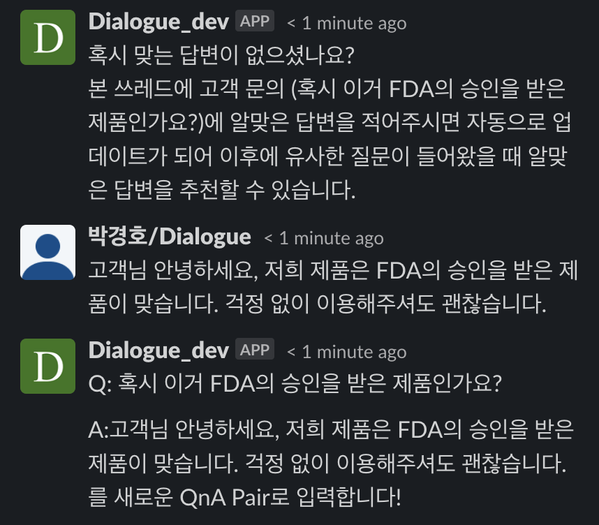

# 원하는 추천 답변이 없을 때

### 추천된 답변들 중, 원하는 답변이 없으셨나요?

고객 문의에 대한 답변을 전에 작성했는지 기억이 나지 않으신가요? 새로운 이벤트나 제품, 신규 기능에 대해 고객이 문의를 남기셨나요? 추천된 답변들 중에 맞는 답변이 없으셨나요?

간혹, Dialogue가 추천한 답변들 중 원하는 답변이 없으실 수도 있습니다.&#x20;

이런 경우에는 엑셀 시트에서 작성한 답변이 있는지 확인하실 필요 없이, 아래 이미지처럼 `admin-{고객사명}` 의 고객 문의 메시지에 쓰레드로 곧바로 답변을 작성해주세요.

<figure><figcaption></figcaption></figure>

작성해주신 답변은 상담 로직 엑셀 시트에 자동으로 반영됩니다. 만약 과거에 답변을 이미 작성해두셨다면, 이번에 작성해두신 내용으로 업데이트됩니다.

다음에 유사한 고객 문의가 인입되면, Dialogue가 이번에 작성해주신 답변을 추천해드립니다.

### 상담 로직을 대규모로 업데이트하고 싶으신가요?&#x20;

* Dialogue팀에서 전달드린 엑셀 시트의 `Q&A` 탭에 바로 수정, 추가, 삭제해주시면 됩니다.
* 수정, 추가, 삭제하신 이후에, 슬랙의 `request-{고객사명}`에서 Dialogue팀을 불러주세요. 변경사항을 확인한  후 바로 배포해드립니다.
