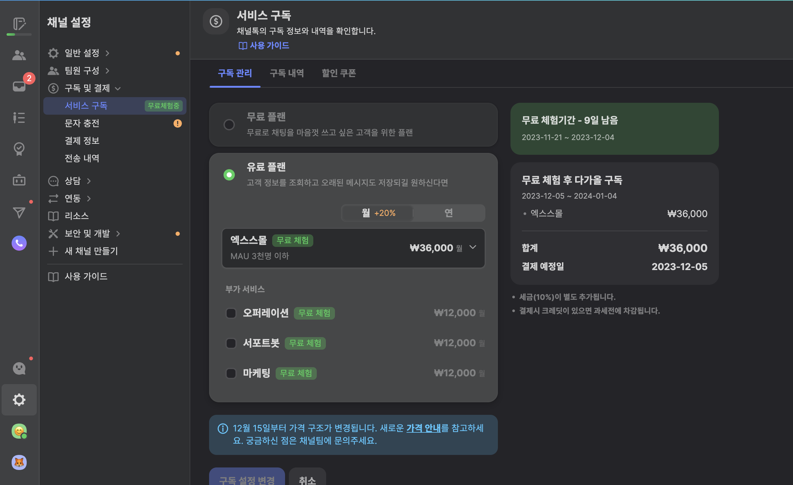

# 채널톡 연동하기

### Step 1. 채널톡 멤버십 확인

* 먼저, https://desk.channel.io의 왼쪽 하단의 `채널 프로필` (:gear:)을 눌러주세요.
* `구독 및 결제` 를 누르고, 그 안에 있는 `서비스 구독` 항목을 눌러주세요.
* 현재 이용 중이이신 플랜이 `유료 플랜` 인지 확인해주세요.&#x20;
* Dialogue와 연동하기 위해서는 `무료 플랜`이 아닌 `유료 플랜`을 이용해주셔야 합니다.
  * 단, 오퍼레이션, 서포트봇, 마케팅 의 부가 서비스를 꼭 이용하실 필요는 없습니다.

<figure><figcaption></figcaption></figure>

### Step 2. Webhook 만들기

* 유료 플랜을 이용 중이시거나 가입하셨다면, 왼쪽 사이드바의 :tools: `보안 및 개발` 을 눌러주세요.
* 그 안에 있는 `웹훅` 을 눌러주세요.&#x20;
* 오른쪽 상단에 있는 `Webhook 만들기` 버튼을 눌러주세요.

<figure><figcaption></figcaption></figure>

### Step 3. Webhook 설정하기

* Webhook (웹훅)은 상담 채널로 들어온 메시지를 Hook (잡아 끌어온다) 할 수 있는 기능입니다. Webhook을 이용하여, 상담 채널에 들어온 메시지를 Dialogue 슬랙 채널로 보내준다고 이해하시면 됩니다.
* `이름` 부분에는 고객님이 정하실 임의의 이름을 작성해주시면 됩니다.&#x20;
  * 고민되시면 아래 이미지처럼 `webhook_dev`로 작성해주세요.
* `URL` 부분에는 사전에 Dialogue팀이 전달드린 Dialogue 연동하기 URL을 입력해주세요.
* 그 이외 조건은, 아래 사진처럼 설정해주시면 됩니다.

<figure><figcaption></figcaption></figure>

### 이제 세팅을 마쳤습니다

* 고객님의 채널톡에 유저가 문의를 남기면, Dialogue 슬랙 채널에 문의 내용과 추천 답변이 자동으로 등록됩니다.
* 채널톡으로 들어온 문의를 복사/붙여넣기 하실 필요 없이, 바로 Dialogue 슬랙 채널에서 확인하실 수 있습니다.

