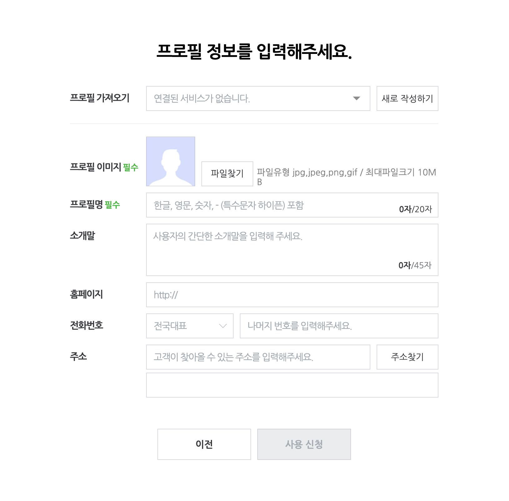

# 네이버 톡톡 연동하기

### Step 1. 네이버 톡톡 파트너센터 이동하기

* [네이버 톡톡 파트너센터](https://partner.talk.naver.com/)로 방문하고, 로그인해주세요.
* 이 때, 회사에서 사용하시는 계정, 혹은 업무에 이용하시는 개인 계정으로 로그인해주세요.
* 로그인하시면, 아래와 같이 [내 계정](https://partner.talk.naver.com/accounts?isMobile=false) 항목으로 이동해주세요.
* 해당 화면에서, `새로운 톡톡 계정 만들기` 영역을 클릭해주세요.

<figure><figcaption></figcaption></figure>

### Step 2. 톡톡 계정 만들기

* `건너뛰기` 버튼을 눌러주세요. (스마트스토어에는 바로 뒤에 연동하실 수 있습니다.)

<figure><figcaption></figcaption></figure>

* 계정대표 정보로는 `개인`을 눌러주세요. (필요 시 국내사업자, 해외사업자, 기관/단체 등으로 변경하시면 됩니다)

<figure><figcaption></figcaption></figure>

* 프로필 정보를 입력해주시고, 사용 신청 버튼을 눌러주세요.
  * `프로필 가져오기` 부분은 생략하셔도 괜찮습니다.
  * `필수`가 붙어있는 영역만 우선적으로 채워주셔도 괜찮습니다.

<figure><figcaption></figcaption></figure>

* 사용 신청을 완료하시면, 네이버 톡톡 파트너 센터에서 신청서를 검수합니다. 검수에는 평일 기준 약 30분 정도 소요되었으나, 고객사마다 다를 수 있습니다.
* 검수가 완료되면, SMS 문자로 알림이 전송됩니다. SMS 문자를 수신하신 이후, 아래 단계부터 진행해주세요.

### Step 3. 네이버 톡톡 챗봇 설정하기

* 네이버 톡톡 파트너센터의 [내 계정](https://partner.talk.naver.com/accounts?isMobile=false)으로 이동한 이후 , `계정관리` 버튼을 클릭해주세요.
* 이 때, 내 계정이 `사용중` 상태가 되어있어야 합니다.
  * 만약 `검수중` 상태로 되어있다면, 검수가 완료될 때 까지 기다려주세요.
  * 만약 `검수중` 상태가 변경되지 않는다면, Dialogue팀에 바로 문의해주세요.

<figure><figcaption></figcaption></figure>

* 계정관리 내 개발자도구 > 챗봇API 설정을 클릭해주세요.

<figure><figcaption></figcaption></figure>

* `신청하기` 버튼을 눌러주세요.

<figure><figcaption></figcaption></figure>

* 챗봇API 신청에 필요한 정보들을 기재해주시고, 작성완료 버튼을 눌러주세요.&#x20;
  * 4.챗봇을 어떻게 구축하실 예정인가요? 질문에는 `기타` 를 선택해주세요.&#x20;
  * 5.네이버톡톡 챗봇을 구축하고자 하는 목적은 무엇인가요? 질문에는 자유롭게 작성해주세요.
    * ex. 고객 상담, CS 응대 등

<figure><figcaption></figcaption></figure>

* 마지막으로 약관에 동의해주시고, `확인` 버튼을 클릭해주세요.

<figure><figcaption></figcaption></figure>

### Step 4. Webhook 세팅

* Webhook 항목으로 이동하신 후, `이벤트 받을 URL`에 Dialogue팀이 이메일로 전달드린 URL을 입력해주세요.
  * Webhook (웹훅)은 상담 채널로 들어온 메시지를 Hook (잡아 끌어온다) 할 수 있는 기능입니다. Webhook을 이용하여, 상담 채널에 들어온 메시지를 Dialogue 슬랙 채널로 보내준다고 이해하시면 됩니다.

<figure><figcaption></figcaption></figure>

* `Event 선택` 영역의 `이벤트 변경` 버튼을 눌러주시고, 모든 이벤트를 다 선택해주시고 `저장`을 눌러주세요.

<figure><figcaption></figcaption></figure>

### 이제 세팅을 마쳤습니다

* 고객님의 스마트스토어 톡톡에 유저가 문의를 남기면, Dialogue 슬랙 채널에 문의 내용과 추천 답변이 자동으로 등록됩니다.
* 톡톡으로 들어온 문의를 복사/붙여넣기 하실 필요 없이, 바로 Dialogue 슬랙 채널에서 확인하실 수 있습니다.

