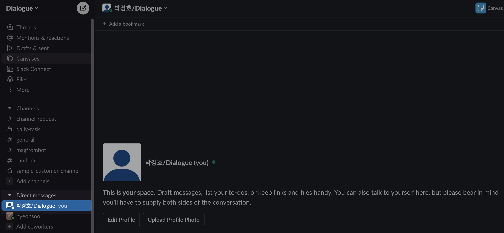

# Dialogue 슬랙 가입하기

### Step 1. 아래 "슬랙 채널 가입하기"를 눌러, Dialogue 슬랙에 가입합니다.

* [슬랙 채널 가입하기](https://join.slack.com/t/dialogue-admin/shared\_invite/zt-25tev1nsn-gLgbQtze4ogH84Sw6GcWkQ)

### Step 2. 이름을 변경해주세요.

이름을 변경하시려면, 먼저 슬랙창 왼쪽 아래 부분에 있는 Direct Messages 부분으로 가셔서

<figure><figcaption></figcaption></figure>

고객님의 프로필을 클릭하시고, Edit Profile 버튼을 눌러주세요

<figure><figcaption></figcaption></figure>

Dialogue팀이 고객님을 알아볼 수 있도록 Display Name에 \[이름/소속] 형태로 작성해주시면 됩니다.&#x20;

<figure><figcaption></figcaption></figure>

