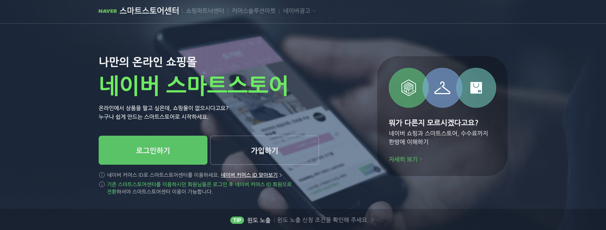
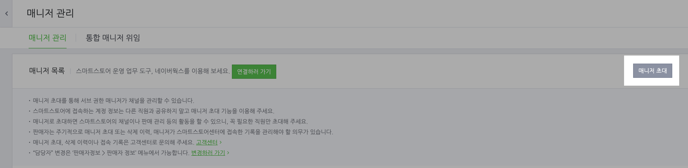
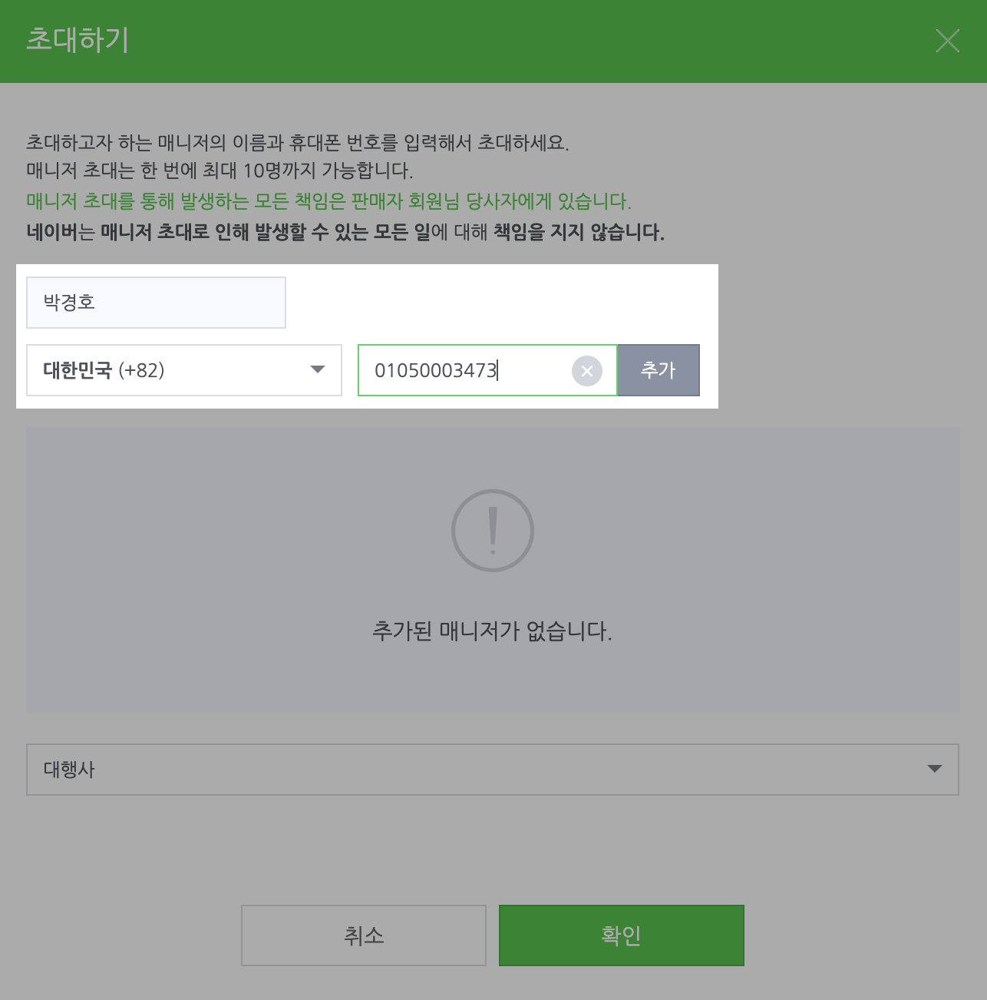
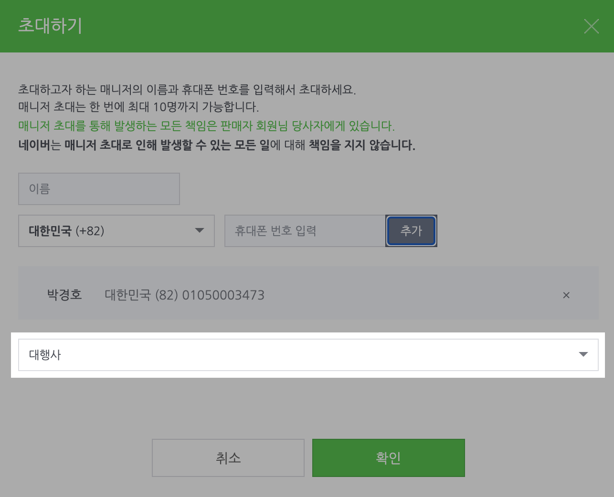

# 스마트스토어 매니저 권한 부여

### Step 1. 스마트스토어 관리자 로그인

* [스마트스토어 센터](https://sell.smartstore.naver.com/#/home/about)로 이동하신 후, 로그인을 진행해주세요.

<figure><figcaption></figcaption></figure>

### Step 2. 스마트스토어센터에서 왼쪽 사이드바의 \[판매자 정보] > \[매니저 관리]로 이동해주세요.

* 이 [링크](https://sell.smartstore.naver.com/#/member/auth/management)를 누르시면 바로 접근하실 수 있습니다.
* 접근이 안되시는 경우, 왼쪽 사이드바에서 해당 메뉴를 찾아서 접근해주시면 됩니다.

<figure><figcaption></figcaption></figure>

### Step 3. \[매니저 초대] 버튼을 클릭해주세요.&#x20;

<figure><figcaption></figcaption></figure>

### Step 4. Dialogue팀의 대표 계정을 입력해주세요.

* 이름: 박경호
* 연락처: 010-5000-3473 (Dialogue팀의 대표 연락처입니다.)

<figure><figcaption></figcaption></figure>

### Step 5. 권한을 \[대행사] 또는 \[부매니저]로 선택해주시고, \[확인]을 클릭해주세요.

<figure><figcaption></figcaption></figure>

### 스마트스토어 매니저 권한 부여가 완료되었습니다!

상담 로직 구축이 완료되신 이후에는, 해당 권한을 삭제해주셔도 괜찮습니다.&#x20;

