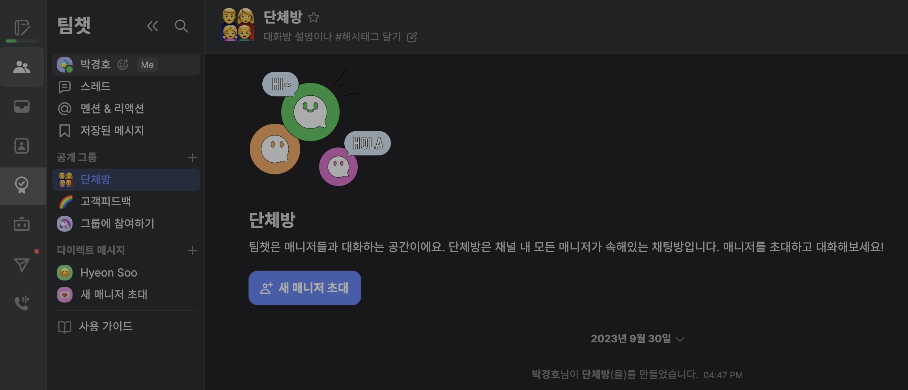
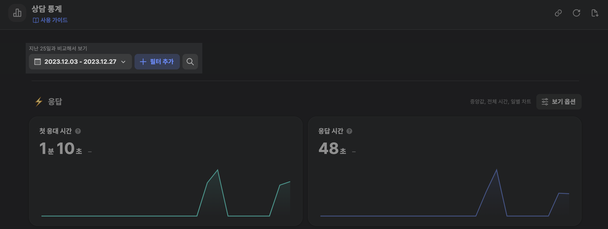
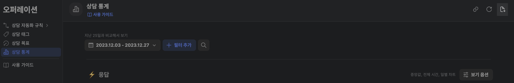
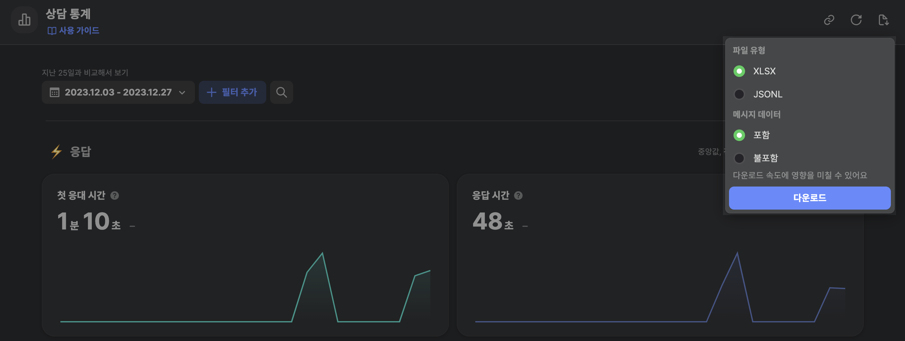

# 채널톡 상담 데이터 다운받기

### Step 1. 채널톡 내 \[오퍼레이션] 으로 이동하기

* 왼쪽 사이드바에 있는 \[오퍼레이션] 항목을 클릭해주세요. (아래 이미지에 밝은 표시가 되어있는 영역입니다.)

<figure><figcaption></figcaption></figure>

### Step 2. \[오퍼레이션] 내 \[상담 통계]를 클릭해주세요.

* 왼쪽 사이드바이 \[상담 통계] 항목을 클릭해주세요. (아래 이미지에서 밝은 표시가 되어있는 영역입니다.)

<figure><figcaption></figcaption></figure>

### Step 3. 조회 기간을 설정해주세요.

* 매뉴얼 제작에 반영하고자 하시는 상담 기간을 설정해주세요. (아래 이미지의 밝은 영역입니다.)
* 많으면 많을 수록 상담 매뉴얼을 꼼꼼하게 작성해드릴 수 있습니다.
  * 샘플로 전달해주시는 경우 최근 1주일 가량
  * 운영에 사용하실 매뉴얼을 위해 전달해주시는 경우 최근 1개월에서 3개월 사이 가량

조회 기간으로 설정해주시면 가장 좋습니다.

<figure><figcaption></figcaption></figure>

### Step 4. 우측 상단의 \[데이터 다운로드] 항목을 클릭해주세요.

<figure><figcaption></figcaption></figure>

### Step 5. 다운로드 옵션을 선택해주세요.

* 파일 유형은 `XLSX`로, 메시지 데이터는 `포함` 옵션으로 선택해주시면 됩니다.
* 아래 이미지와 동일하게 선택해주세요.

<figure><figcaption></figcaption></figure>

### Step 6. \[이유]와 \[비밀번호]를 선택해주시고, 다운로드된 엑셀 파일을 Dialogue팀에 공유해주세요.

* 데이터를 다운로드 받으시고, Dialogue팀에&#x20;
  * 다운로드된 엑셀 파일
  * 엑셀 파일 비밀번호

를 전달해주세요. `kyungho.dev@gmail.com`으로 보내주시거나, 슬랙 채널에서 전달주시면 됩니다.

### 스마트스토어 매니저 권한 부여가 완료되었습니다!

상담 로직 구축이 완료된 이후 전송해주신 엑셀 파일은 즉시 파기합니다.
