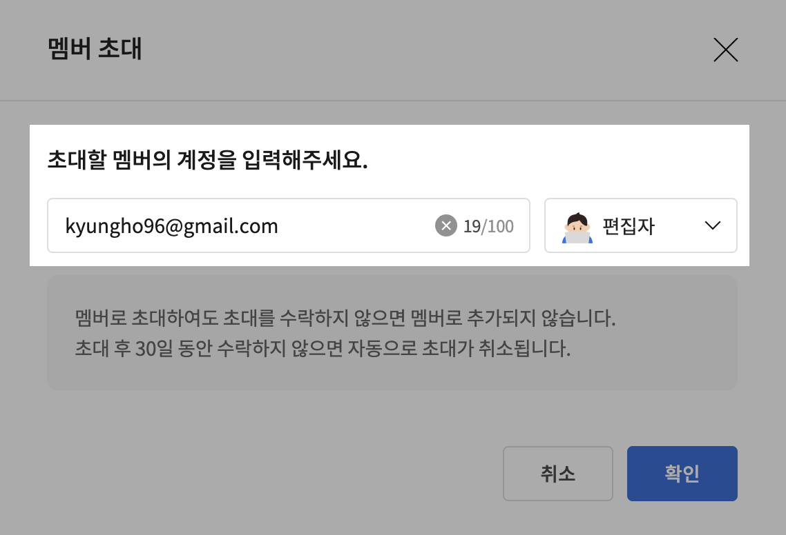

# 카카오톡 채널 편집자 권한 부여

### Step 1. 카카오톡 채널로 이동하기&#x20;

* 카카오톡 채널 [대시보드](https://business.kakao.com/dashboard/)로 이동하시어, 로그인을 진행해주세요.
* 로그인 하신 후, 이용 중이신 비즈니스 그룹을 클릭해주세요.

<figure><figcaption></figcaption></figure>

### Step 2. 왼쪽 사이드바의 \[멤버] 항목을 클릭해주세요.

<figure><figcaption></figcaption></figure>

### Step 3. \[멤버 초대] 버튼을 클릭해주세요.

<figure><figcaption></figcaption></figure>

### Step 4. 아래 이미지와 같이 Dialogue팀의 대표 정보를 입력해주세요.

* 이메일 주소: kyungho96@gmail.com (Dialogue팀 대표자의 이메일입니다)
* 권한: `편집자`

<figure><figcaption></figcaption></figure>

### 카카오톡 채널 편집자 권한 부여가 완료되었습니다!

상담 로직 구축이 완료되신 이후에는, 해당 권한을 삭제해주셔도 괜찮습니다.&#x20;

