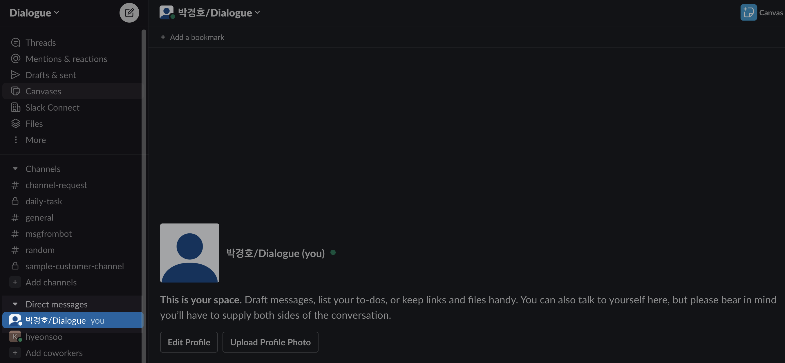
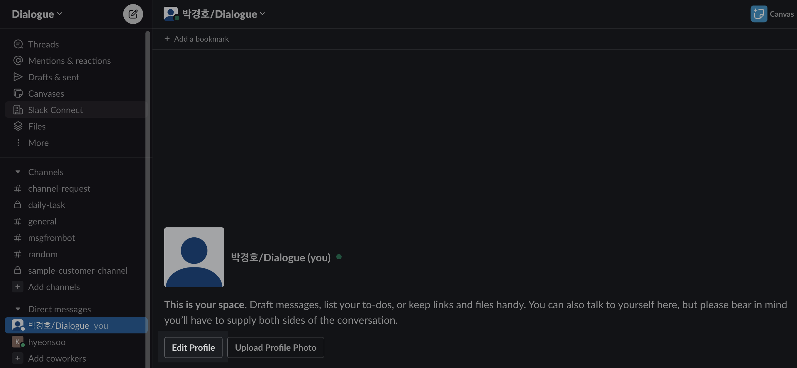

# 3단계. 슬랙 채널 가입하기

### 여러 채널에서 들어오는 고객 문의와 추천 답변을 슬랙 채널에서 확인하실 수 있습니다.

Dialogue는 여러 채널에서 문의와 추천 답변들은 슬랙 채널에서 확인하실 수 있습니다. 아래 가이드를 따라 슬랙 채널에 가입해주세요.

### Step 1. 아래 "슬랙 채널 가입하기"를 눌러, Dialogue 슬랙에 가입합니다.

* [슬랙 채널 가입하기](https://join.slack.com/t/dialogue-admin/shared\_invite/zt-25tev1nsn-gLgbQtze4ogH84Sw6GcWkQ)

### Step 2. 이름을 변경해주세요.

이름을 변경하시려면, 먼저 슬랙창 왼쪽 아래 부분에 있는 Direct Messages 부분으로 가셔서

<figure><figcaption></figcaption></figure>

고객님의 프로필을 클릭하시고, Edit Profile 버튼을 눌러주세요

<figure><figcaption></figcaption></figure>

Dialogue팀이 고객님을 알아볼 수 있도록 Display Name에 \[이름/소속] 형태로 작성해주시면 됩니다.&#x20;

<figure><figcaption></figcaption></figure>

### Step 3. Dialogue팀이 고객님의 채널로 초대드립니다

Dialogue 슬랙에서는 총 2개의 채널을 이용하시면 됩니다.

* `admin-{고객사명}` : 고객 문의에 대한 추천 답변을 확인하실 수 있는 채널로, 고객 상담에 주로 사용하실 채널입니다.
* `request-{고객사명}` : 상담 매뉴얼에 수정, 변경이 있거나 Dialogue팀에 궁금하신 점이 있으실 때 질문을 남겨주시는 채널입니다. Dialogue팀이 확인 즉시 회신드립니다.

슬랙에 가입하시면, Dialogue팀이 고객님을 각 채널에 초대드립니다. 초대된 이후, 왼쪽 Channels 탭에서 고객님이 가입하신 채널들을 찾아보시거나 검색하실 수 있습니다.

<figure><figcaption></figcaption></figure>

### 모든 단계가 완료되었습니다! 이제, Dialogue와 함께 정확하고 빠른 고객상담을 시작하세요 :)

