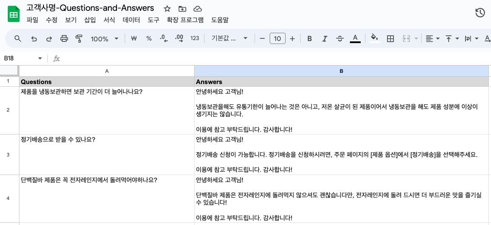
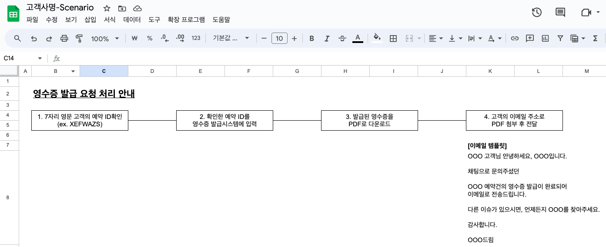

# 2단계. 정리된 상담로직 확인하기

### Dialogue팀이 정리한 상담로직을 검토해주세요.

Dialogue는 고객님이 전달주신 상담 매뉴얼과 데이터를 참고하여 적절한 답변을 추천합니다. Dialogue팀이 정리한 답변을 한 번 검토해주세요.

고객님께서 검토해주실 응대로직은 아래 2가지입니다.

* 단순한 문의에 대한 응답이 담긴 `Q&A`
* 대화가 오고가는 문의에 대한 응답이 담긴 `시나리오`

### Q\&A는 손쉽게 검토할 수 있는 Google Spreadsheet로 제공드립니다.

<figure><figcaption></figcaption></figure>

* Q\&A는 고객의 문의를 한 번의 답변으로 해결할 수 있는 응대로직입니다. 사전에 전달주신 업무 매뉴얼과 상담 데이터를 참고하여, Dialogue팀이 제작한 고객의 질문과 그에 대한 답변이 담겨있습니다.&#x20;
* 질문과 답변이 정확하게 기재되어있는지, 메시지의 톤을 수정할 것은 없는지 등을 검토해주시고, Google Spreadsheet에서 바로 수정해주시면 됩니다.

### 시나리오는 한 눈에 들어오는 그림(flowchart)으로 제공드립니다.

<figure><figcaption></figcaption></figure>

* 시나리오는 고객과 여러번 대화를 해야만 해결할 수 있는 응대로직입니다.&#x20;
* 사전에 전달주신 업무 매뉴얼과 상담 데이터를 참고하여, Dialogue팀이 제작한 응대 흐름 (flow)가 담겨있습니다.&#x20;
* Q\&A와 동일하게 고객 응대 순서가 정확하게 쓰여있는지, 응대를 위한 메시지의 톤을 수정할 것은 없는지 등을 검토해주시고, Google Spreadsheet에서 바로 수정해주시면 됩니다.
