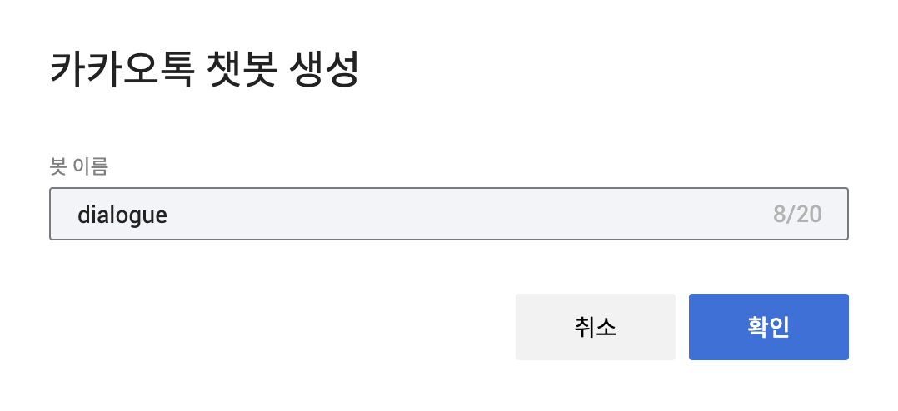
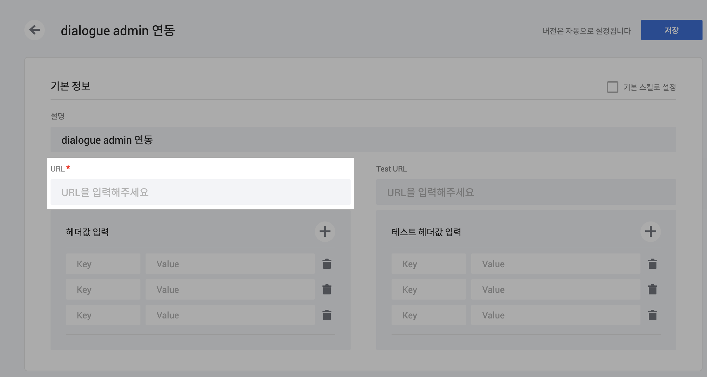
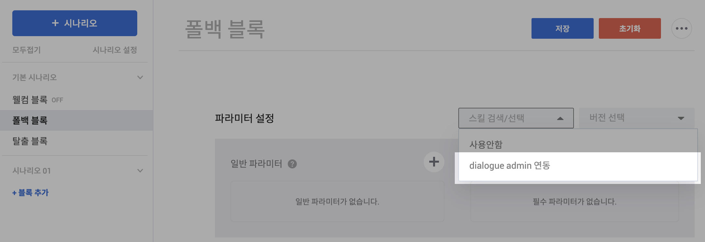
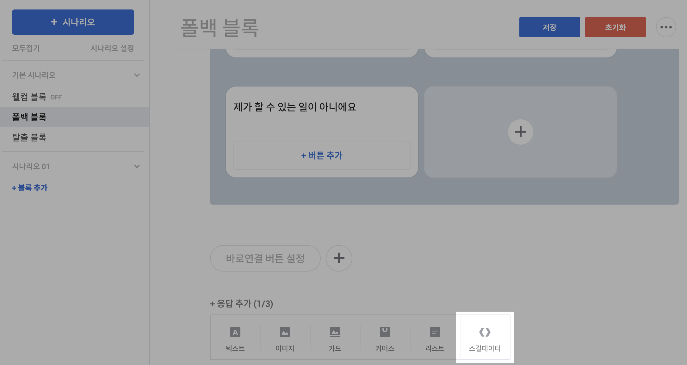
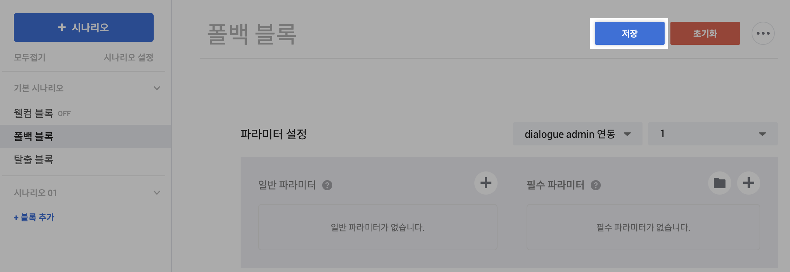
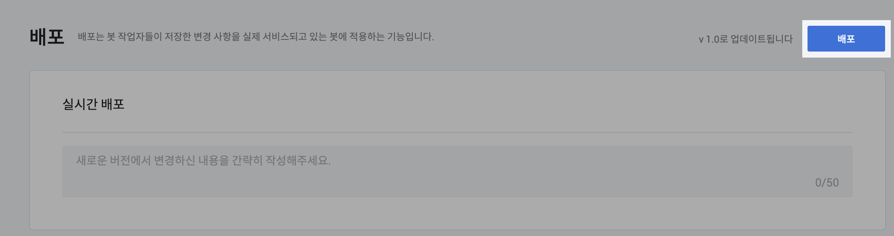
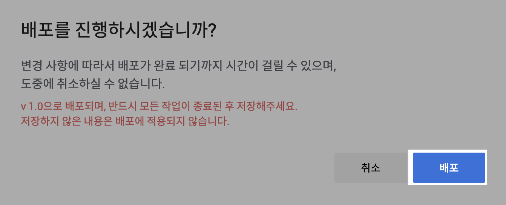

# 3-1. 카카오톡 채널 연동하기

### 카카오톡 챗봇 관리자 센터 로그인합니다.

* 이 링크를 눌러 카카오톡 [챗봇 관리자센터](https://chatbot.kakao.com/)로 이동하고, 로그인해주세요.
* 현재 카카오톡 채널을 이용 중이시라면, 별도 가입 없이 바로 로그인하실 수 있습니다.

### 챗봇 생성

* 아래 가이드 순서에 맞추어 챗봇 관리자센터에서 새로운 봇을 생성합니다.

"봇 만들기" 버튼을 클릭합니다.

<figure><figcaption></figcaption></figure>

"카카오톡 챗봇"을 선택합니다.

<figure><figcaption></figcaption></figure>

"봇 이름" 부분에 "dialogue"를 기입하고, 확인을 눌러 봇을 생성합니다.

### 스킬 등록

* 카카오톡 채널과 Dialogue 서버를 연결하는 단계입니다.&#x20;
* 아래 가이드를 따라 카카오톡채널과 Dialogue 서버를 연결해주세요.

왼쪽 사이드바의 "스킬 목록"을 클릭해서, 스킬 생성 화면으로 이동합니다.

<figure><figcaption></figcaption></figure>

오른쪽의 "생성" 버튼을 누릅니다.

<figure><figcaption></figcaption></figure>

"스킬명"에 "dialogue admin 연동", "기본 정보"에도 동일하게 "dialogue admin 연동"이라고 작성해주세요. 그리고, "URL"이라고 표시된 부분에 Dialogue팀에서 전달드린 URL을 작성해주세요.

<figure><figcaption></figcaption></figure>

그 이후, 오른쪽 위의 "저장" 버튼을 클릭하여 스킬을 저장합니다.

<figure><figcaption></figcaption></figure>

왼쪽 사이드바의 "시나리오" 영역을 선택하고, 그 다음에 "폴백 블록"을 선택합니다.

<figure><figcaption></figcaption></figure>

"스킬 검색/선택" 영역을 클릭하고, "dialogue admin 연동" 스킬을 선택합니다.

<figure><figcaption></figcaption></figure>

화면 스크롤을 아래로 내려, "스킬데이터" 영역을 선택합니다.

<figure><figcaption></figcaption></figure>

오른쪽 상단의 "저장" 버튼을 클릭해서 작업 내용을 저장합니다.

<figure><figcaption></figcaption></figure>

### 배포하기

* 마지막으로. Dialouge 서버와 연결한 내용을 카카오톡 채널에 적용하고, 배포합니다.
* 아래 가이드를 따라 마지막 단계인 배포를 진행해주세요.

왼쪽 하단의 사이드바에서 "배포"를 클릭합니다.

<figure><figcaption></figcaption></figure>

오른쪽 상단의 "배포" 버튼을 클릭합니다.

<figure><figcaption></figcaption></figure>

"배포" 버튼을 클릭해서, 카카오톡 연동을 마칩니다.

<figure><figcaption></figcaption></figure>

### 카카오톡 채널 연동을 완료했습니다!

카카오톡 채널로 인입되는 고객 문의를 Dialogue 슬랙 채널에서 확인하고, 추천 답변을 받아볼 수 있습니다.&#x20;

연동 과정에서 막히거나 어려운 점이 있으셨다면, 아래 방법으로 Dialogue팀을 찾아주세요.

> email: kyungho.dev@gmail.com로 문제 상황을 알려주세요
>
> slack: `channel-{고객사명}-request` 에서 문제 상황을 알려주세요

